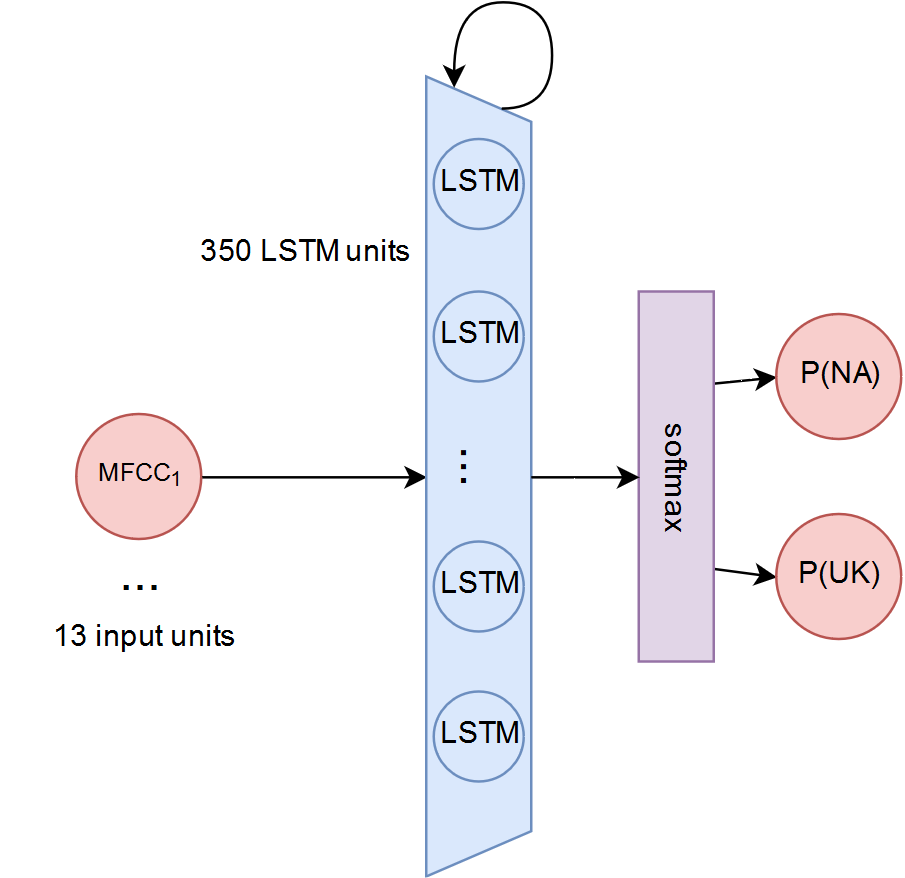
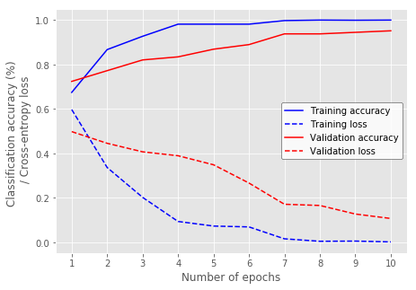
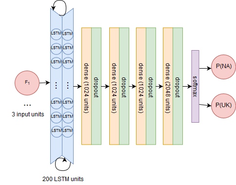
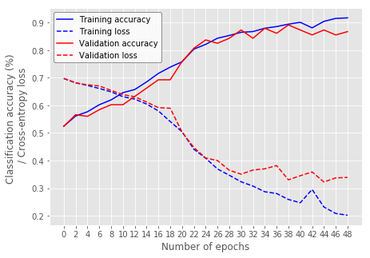

+++
title = "Speaker Accent Classification with Deep Learning"
date = 2019-01-12T17:04:01-05:00
draft = false

# Authors. Comma separated list, e.g. `["Bob Smith", "David Jones"]`.
authors = []

# Tags and categories
# For example, use `tags = []` for no tags, or the form `tags = ["A Tag", "Another Tag"]` for one or more tags.
tags = ["deep-learning"]
categories = ["deep-learning"]

# Links (optional).
url_pdf = ""
url_code = "https://github.com/violetguos/project-ift6390/blob/master/Speaker%20Accent%20Classification%20with%20Deep%20Learning%20-%20Poster.pdf"
url_dataset = ""
url_slides = ""
url_video = ""
url_poster = "https://github.com/violetguos/project-ift6390/blob/master/Speaker%20Accent%20Classification%20with%20Deep%20Learning%20-%20Poster.pdf"

# Projects (optional).
#   Associate this post with one or more of your projects.
#   Simply enter your project's folder or file name without extension.
#   E.g. `projects = ["deep-learning"]` references
#   `content/project/deep-learning/index.md`.
#   Otherwise, set `projects = []`.
# projects = ["internal-project"]

# Featured image
# To use, add an image named `featured.jpg/png` to your page's folder.
[image]
  # Caption (optional)
  caption = ""

  # Focal point (optional)
  # Options: Smart, Center, TopLeft, Top, TopRight, Left, Right, BottomLeft, Bottom, BottomRight
  focal_point = ""
+++

The task of classifying the accent of recorded speech has generally been approached with traditional SVM or UBM-GMM methods (Omar and Pelecanos, 2010; Ge, 2015). However, modern deep learning methods yield the potential to dramatically increase performance. In our report, we train several varieties of Recurrent and Convolutional Neural Networks on three types of features (MFCC, formant, and raw spectrogram) extracted from North American and British English speech recordings in order to predict the accent of the speaker. All deep learning methods examined surpass non-deep baselines, and the approach yielding the best performance was the MFCC-RNN, shortly followed by the Spec-CNN.

The MFCC-RNN performs best on our accent classification task, likely due to its sufficiently complex and salient features and its ability to take contextual information into account, and its performance is shortly followed by that of the the Spec-CNN (which may outperform the MFCC-RNN given more data and more computational power). The Formant-RNN performs worst of the three, likely due to the excessively low amount of information present in its features.

A straightforward next step in evaluating these network architectures and feature choices would be to extend them beyond binary classification, including data from many varieties of English. This would allow a more direct comparison with works such as Chu, Lai, and Le (2017), which was unable to classify multiple varieties of accented English well using an MFCC approach.

Further future work might include expansion on the Spec-CNN, since current research continues to look into new types of convolution to curate filters for audio signals. One successful application of CNNs with raw audio involves using parametrized sinc functions in the convolution layer instead of a traditional convolution, as in SincNet developed by Ravanelli and Bengio (2018). Dilated convolutions have also been shown to be useful for accent correction and audio generation, since they allow the receptive fields to grow longer in a cheaper way than do LSTMs or other RNNs (Oord et al., 2016).

Though it underperformed in this work, the above-baseline performance of the Formant-RNN also holds potential due to the easy interpretability of its features. Future work might construct a mapping from the features picked out as important by the network back to their original timestamp, which could be the basis of an accent correction system that delivers feedback to a user about which portions of their speech need adjustment in order to imitate a certain accent. This is especially applicable to the Formant-RNN since there is a well-understood relationship between the configuration of the mouth and the first two formants of a vowel. Such a system could provide practical instructions to the user (i.e. to raise or lower the tongue, round the lips, etc.) and could have applications in language learning or speech therapy tools.

