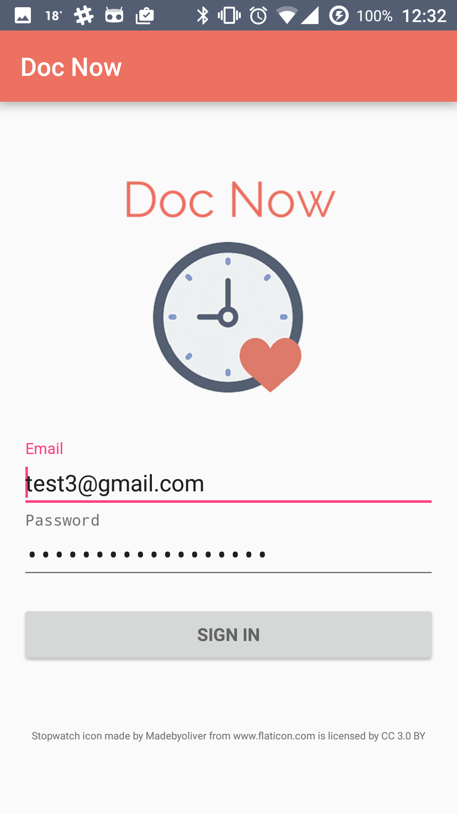
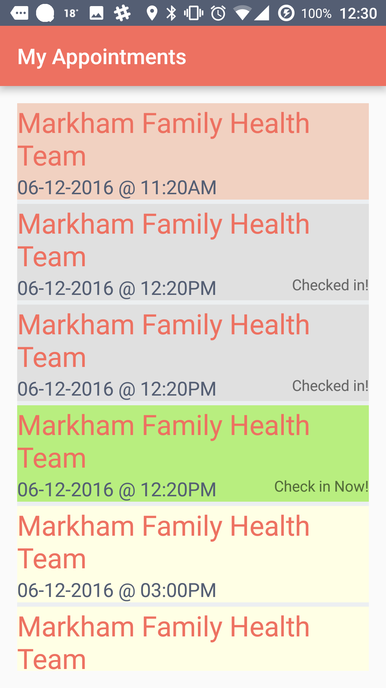
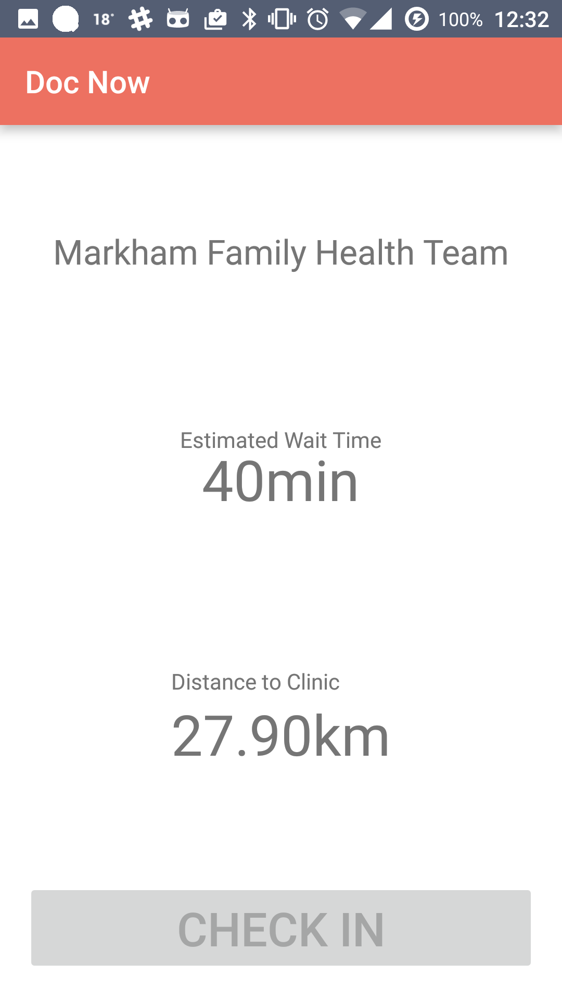
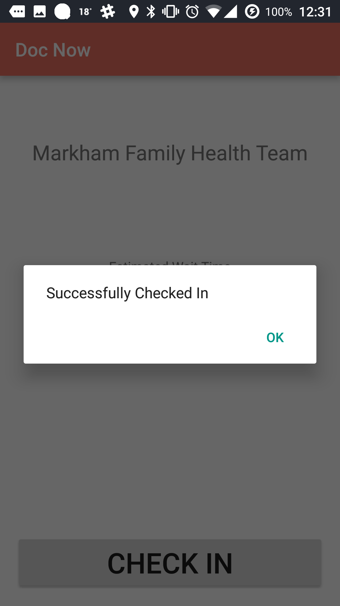

+++
title = "Android app to reduce clinic wait time"
date = 2016-06-12T16:57:28-05:00
draft = false

# Authors. Comma separated list, e.g. `["Bob Smith", "David Jones"]`.
authors = []

# Tags and categories
# For example, use `tags = []` for no tags, or the form `tags = ["A Tag", "Another Tag"]` for one or more tags.
tags = ["android", "hackathon"]
categories = ["android", "hackathon"]

# Projects (optional).
#   Associate this post with one or more of your projects.
#   Simply enter your project's folder or file name without extension.
#   E.g. `projects = ["deep-learning"]` references
#   `content/project/deep-learning/index.md`.
#   Otherwise, set `projects = []`.
# projects = ["internal-project"]

# Featured image
# To use, add an image named `featured.jpg/png` to your page's folder.
[image]
  # Caption (optional)
  caption = ""

  # Focal point (optional)
  # Options: Smart, Center, TopLeft, Top, TopRight, Left, Right, BottomLeft, Bottom, BottomRight
  focal_point = ""
+++

This is a hackathon project developed outside of school.

## Problem

Far too many Canadians facing long wait times for health services experience frustration and wonder if our healthcare system is broken. Literature points to a negative impact of wait time on patients' perceptions of health care quality, satisfaction and likeability, patients' subsequent behavior, and likelihood of recommendations and repeat visits.

## How it works
Patients with our app, who have booked an appointment can check-in remotely 30 min before their appointment, if they’re close enough to the medical clinic. Alternatively, a receptionist can check patients in. However, patients don’t need to wait in the clinic for hours on end if the queue time is long, but can instead go about their day. When they’re next in line to be seen, patients would be notified to go back to the clinic.

## Code
Angular.js, Express, Node.js, MongoDB, Amazon EC2, Amazon SES, Java, Android

- An Android app that aims to reduce patient waiting time built at Angel Hacks.
- Built with a web platform for hospital staff and a mobile app for patients
- Developed a function to calculate distance and configured user interface

