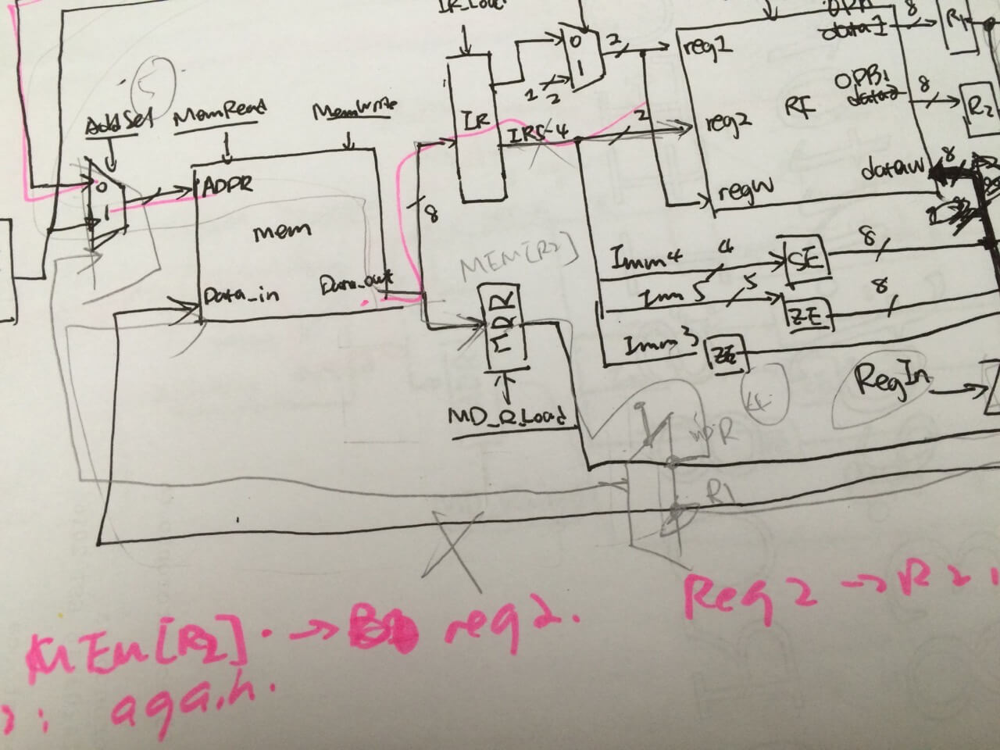

+++
title = "Program MIPS instruction in Verilog"
date = 2016-04-02T06:28:35-05:00
draft = false

# Authors. Comma separated list, e.g. `["Bob Smith", "David Jones"]`.
authors = []

# Tags and categories
# For example, use `tags = []` for no tags, or the form `tags = ["A Tag", "Another Tag"]` for one or more tags.
tags = ['verilog', 'mips', 'hardware']
categories =['verilog', 'mips', 'hardware', 'systems']

# Projects (optional).
#   Associate this post with one or more of your projects.
#   Simply enter your project's folder or file name without extension.
#   E.g. `projects = ["deep-learning"]` references
#   `content/project/deep-learning/index.md`.
#   Otherwise, set `projects = []`.
# projects = ["internal-project"]

# Links (optional).
url_code = "https://github.com/violetguos/multicycle_processor"

# Featured image
# To use, add an image named `featured.jpg/png` to your page's folder.
[image]
  # Caption (optional)
  caption = ""

  # Focal point (optional)
  # Options: Smart, Center, TopLeft, Top, TopRight, Left, Right, BottomLeft, Bottom, BottomRight
  focal_point = ""
+++

## Introduction
In this project, I have built a multi-cycle processor's instruction set from scratch.

## Technical Details
- Programmed a multicycle processor in Verilog on a Altera DE-1 FPGA
- Configured a new Assembly language instruction set with Verilog

## Lessons Learned
In processor or hardware design, unlike computer software, there is no room for uncertainty. For example, a software engineer may put a button in a not so convenient place for no good reason, but it does not hinder the functionality of the app, just harder to navigate. In hardware, everything must be precise. A small error (0 vs 1) results in something completely different. As you can see below, we have tested our design on paper, drawing out each and every cycle of execution. Everything was planned beforehand.
