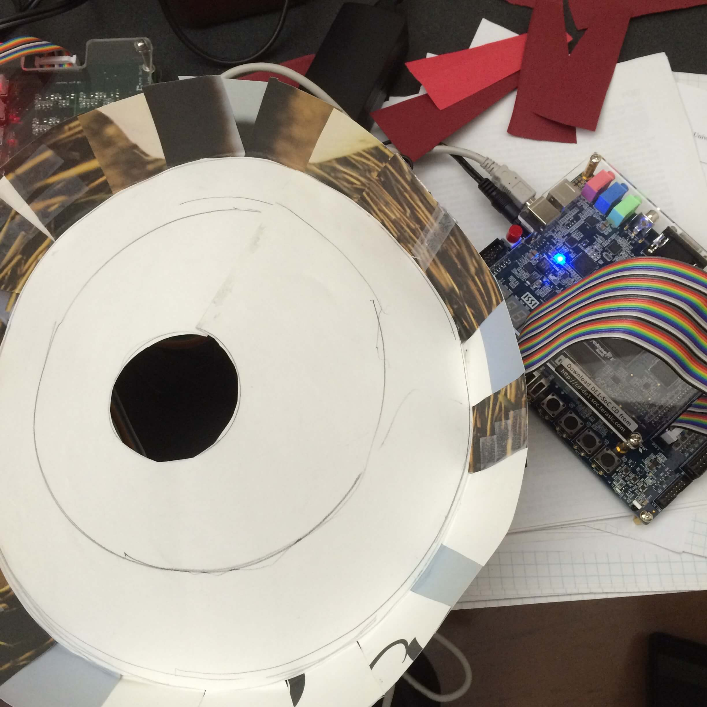

+++
title = "Roulette on FPGA"
date = 2016-04-02T01:29:17-05:00
draft = false

# Authors. Comma separated list, e.g. `["Bob Smith", "David Jones"]`.
authors = []

# Tags and categories
# For example, use `tags = []` for no tags, or the form `tags = ["A Tag", "Another Tag"]` for one or more tags.
tags = []
categories = ["hardware", "systems", "assembly"]

# optional
url_code = "https://github.com/violetguos/rouletteProject"

# Projects (optional).
#   Associate this post with one or more of your projects.
#   Simply enter your project's folder or file name without extension.
#   E.g. `projects = ["deep-learning"]` references
#   `content/project/deep-learning/index.md`.
#   Otherwise, set `projects = []`.
# projects = ["internal-project"]

# Featured image
# To use, add an image named `featured.jpg/png` to your page's folder.
[image]
  # Caption (optional)
  caption = ""

  # Focal point (optional)
  # Options: Smart, Center, TopLeft, Top, TopRight, Left, Right, BottomLeft, Bottom, BottomRight
  focal_point = ""
+++

## Introduction
This project was built in the same course as the multi-cycle CPU! As the reader can see, low level hardware can be fun. The two projects share similar principles, but this project has additional displays, such as a computer screen, a speaker for audio output, and we made the roulette as pretty as we could. They all run on the same hardware chip(field programmable gate array, FPGA).

## Technical Details
- Built a roulette game with PS/2 keyboard, audio output, motor, lego controller, and Altera FPGA
- Implemented linear feedback shift register in Assembly and C to randomize motor speed and spin time
- Interfaced keyboard input to prompt user’s bet and display on VGA output with JTAG UART, JPIO ports

## Lessons Learned
User interface (the screen display, music, and the roulette) makes a difference
Creativity matters: engineers should not only focus on the technical details

Note: this is not my final version. Unfortunately the finished product and a recorded video demo were lost.
